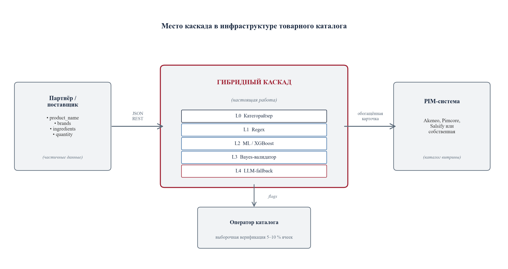

# Глава 1. Развёрнутая актуальность темы

В главе обосновывается тема работы, систематизируются существующие подходы к автоматическому обогащению товарных данных и формулируется техническое задание на разрабатываемую систему.

## 1.1 Проблема обогащения товарных каталогов интернет-магазина

### 1.1.1 Электронная коммерция и роль товарных данных

Рынок электронной коммерции устойчиво растёт: годовой оборот российского сегмента в 2025 году — 11,5 трлн руб. [1], мировой рынок продолжает расширяться [2]. Каталоги крупных площадок насчитывают десятки миллионов позиций (индексируемая часть Ozon — > 38 млн [3]); ежедневно добавляются тысячи новых артикулов от партнёров.

Карточка товара — центральный элемент цифровой витрины: от её атрибутов (тип, состав, габариты, маркировки качества, страна происхождения, предупреждения) зависит фасетный поиск, релевантность ранжирования, аналитика и конверсия. При неполном заполнении цепочка «партнёрский фид — каталог — редактура — витрина» прерывается во втором звене: товар либо попадает на витрину неполным (страдает конверсия), либо задерживается на ручную доработку (растут операционные затраты).

Рисунок 1.1 — Место системы автоматизированного обогащения в инфраструктуре интернет-магазина

### 1.1.2 Неоднородность партнёрского ввода

Партнёрские данные принципиально неоднородны: для одного товара поставщик передаёт только название и бренд, для другого — расширенный набор полей с фотографиями, для третьего — состав на иностранном языке, для четвёртого доступен только штрихкод. Анализ Open Food Facts [13] показывает, что заполненность нутри-полей систематически ниже базовых.

Пробелы исторически закрываются контент-менеджерами вручную: на каждую карточку — десятки атрибутов. При каталоге в миллионы позиций и тысячах новых записей в сутки такой путь экономически неприемлем [4]. Дополнительно ручной труд плохо масштабируется по языкам: команда, работающая с RU/EN, теряет качество на FR, DE, IT, ES — особенно в категориях импортной пищевой продукции.

### 1.1.3 Эффекты неполной карточки на пользовательский опыт

Неполная карточка даёт три независимых воздействия: (1) снижается качество фасетного поиска (товар выпадает из подборок при применении фильтров — например, упаковка пасты без формы или типа зерна); (2) растут возвраты и негативная обратная связь, особенно по атрибутам правового или диетического значения (органика, глютен, аллергены); (3) растёт нагрузка на модерацию — «брошенная» карточка удлиняет цикл выхода товара на витрину или порождает повторные правки.

### 1.1.4 Существующие системы управления товарной информацией не решают задачу

Класс PIM-систем (Akeneo, Pimcore, Salsify, Riversand, inRiver [5, 6, 7]) сложился из корпоративной потребности хранить и публиковать товарную информацию в едином каталоге. Их функциональность сосредоточена на управлении уже сформированной информацией, не на её извлечении. Появляющиеся модули автоматического обогащения — обёртки над одной публичной LLM с прямым вызовом на каждый товар, экономически приемлемые лишь для каталогов небольшого и среднего размера и не дающие гарантий корректности. Альтернатива в виде агрегаторов готовых описаний задачу извлечения атрибутов из произвольного партнёрского текста не решает и ограничена крупными брендами.

### 1.1.5 Противоречие и постановка задачи

Изложенное определяет противоречие в основе актуальности: автоматизация наполнения — инженерная необходимость, но ни одна отдельная технология не покрывает все типы целевых атрибутов с приемлемой точностью и стоимостью. Правила надёжны на числовых атрибутах, но дают низкое покрытие на семантически нагруженных полях. Классические классификаторы требуют значительной разметки и плохо переносятся между языками. LLM универсальны, но дороги [9] и систематически ошибаются на числовых полях, требующих агрегирования из текста (эмпирическая характеристика — 3.3.2.5).

Из противоречия вытекает рабочая архитектурная гипотеза: каскадная композиция слоёв, в которой каждый следующий слой подключается только к остатку, не закрытому предыдущими с заданной уверенностью, способна совместить преимущества отдельных технологий. Проверка этой гипотезы — содержательное ядро работы.

## 1.2 Литературный обзор

В разделе систематизируется научный и индустриальный задел по трём направлениям, которые образуют основу разрабатываемой системы:

извлечение признаков из текстовых описаний товаров;

каскады больших языковых моделей с учётом стоимости вызовов;

существующие промышленные системы управления товарной информацией.

### 1.2.1 Извлечение признаков из текстовых описаний товаров

Задача восполнения пропущенных атрибутов рассматривается как частный случай извлечения признаков из неструктурированного текста (information extraction, IE). Подходы делятся на три группы — формальные правила, классические статистические модели и нейросетевые модели на трансформерах — и их сочетание образует основу каскадных архитектур.

Правила и регулярные выражения. Формальные шаблоны надёжно извлекают атрибуты с устойчивой лексической разметкой (% жира, масса нетто, время приготовления, минимальный возраст) при околонулевой стоимости и встроенной интерпретируемости; ограничены низким покрытием на семантически нагруженных полях (тип крупы, форма пасты, маркировка органики).

Статистические модели над поверхностными признаками. Классификаторы поверх TF-IDF и градиентный бустинг (XGBoost [14], LightGBM [15]) работают при достаточной выборке и одноязычном входе. Применение ML к классификации в электронной коммерции рассмотрено Г. И. Афанасьевым и соавторами [16]. Слабая переносимость на многоязычные тексты и отсутствие учёта семантики ограничивают применимость.

Векторные представления на основе трансформеров. Архитектура трансформера [17] и BERT [18] подняли качество IE. Sentence-BERT [19] и многоязычные дистиллированные варианты [20] дают фиксированные представления предложений, поверх которых ставится произвольный классификатор. Категоризация и извлечение признаков из товарных каталогов рассмотрены А. Г. Колониным [21]; систематическое изложение NLP и IE — в учебнике Е. И. Большаковой и соавторов [22].

Специализированные системы извлечения атрибутов товаров. В индустриальной литературе выделяются три эталонные системы:

* TXtract [23] (Karamanolakis et al., ACL 2020, Amazon) — многозадачный нейронный кодировщик с условием на таксономию категорий, обеспечивающий извлечение атрибутов в крупных каталогах при значительном дисбалансе классов;
* MAVE [24] (Yang et al., WSDM 2022, Google) — многоисточниковый кодировщик на основе BERT с кросс-вниманием, использующий не только наименование, но и описание, спецификации и другие текстовые поля карточки;
* OpenTag [25] (Zheng et al., KDD 2018) — двунаправленная рекуррентная архитектура BiLSTM-CRF с механизмом внимания, формулирующая задачу извлечения атрибутов как задачу разметки последовательности.

Эти системы дают 85–92 % F1 на специализированных корпусах. Сопоставление с каскадными архитектурами, привлекающими LLM в роли запасного слоя, в открытой литературе систематически не представлено: специализированные системы и LLM-каскады трактуются как раздельные направления. Настоящая работа частично закрывает этот пробел.

### 1.2.2 Стоимостно-чувствительные каскады больших языковых моделей

С появлением спектра LLM разной мощности оформилась подобласть cost-aware LLM routing — направление каждого запроса к минимально достаточной модели без потери качества.

FrugalGPT. L. Chen, M. Zaharia и J. Zou [9] предложили каскадную композицию LLM по возрастанию стоимости с прерыванием на первом уверенном ответе: каскад из 3–4 моделей с откалиброванной уверенностью даёт то же качество, что прямой вызов самой дорогой, при стоимости на порядок ниже. Настоящая работа опирается на идеи последовательного прерывания и калибровки.

AutoMix. P. Aggarwal, A. Madaan и соавторы [10] основываются на самопроверке ответа малой моделью с делегированием к большой при сомнении. Разрабатываемая система, наоборот, разносит роли валидатора и предсказателя в раздельные слои.

Hybrid LLM. D. Ding, A. Mallick и соавторы [11] рассматривают маршрутизацию между моделью на пограничном устройстве и облачной — постановка прямо соответствует сценарию «локально развёрнутая gpt-oss-120b + коммерческое API как запасной слой».

RouterBench. Q. J. Hu, J. Bieker и соавторы [12] показали, что обучаемые маршрутизаторы не доминируют над простыми политиками при локализованной структуре ошибок. На задаче обогащения каталогов в настоящей работе впервые по предзарегистрированному протоколу установлено, что статическое per-(категория, атрибут) правило не уступает обучаемому маршрутизатору по сквозной точности при равном бюджете запасного слоя.

### 1.2.3 Существующие промышленные PIM-системы и анализ аналогов

Для позиционирования разработки относительно индустриальных аналогов отобраны три коммерческие PIM-системы: Akeneo, Pimcore и Salsify. По ним построена сравнительная таблица по семи функциональным критериям, существенным для задачи автоматического обогащения каталога (таблица 1.1). Источниками послужила документация вендоров [5, 6, 7].

Таблица 1.1 — Сравнение существующих PIM-систем и разрабатываемой системы
| № | Критерий | Akeneo | Pimcore | Salsify | Разрабатываемая система |
|---|---|---|---|---|---|
| 1 | Централизованное хранение каталога | да | да | да | не входит в задачу |
| 2 | Распределение по каналам сбыта | да | да | да | не входит в задачу |
| 3 | Автоматическое обогащение атрибутов | нет (только ручная редактура) | частично (правила обогащения) | нет (есть AI Suite как обёртка над сторонней LLM) | да (каскадная архитектура) |
| 4 | Извлечение признаков из неструктурированного текста | нет | нет | нет | да (слои ML и LLM) |
| 5 | Поддержка многоязычного входа | через ручные переводы | через ручные переводы | через ручные переводы | встроенная (многоязычные эмбеддинги, 50+ языков) |
| 6 | Открытый исходный код | community-редакция | да | нет | да (включая возможность локального развёртывания LLM) |
| 7 | Стоимостно-чувствительная обработка | нет | нет | нет | да (каскадная композиция с доминированием по Парето по стоимости и качеству) |

Из таблицы 1.1 следует, что коммерческие PIM-системы хорошо покрывают хранение, версионирование и распределение уже сформированной информации. Однако они систематически не решают задачи извлечения атрибутов из произвольного партнёрского текста. Появляющаяся функция автоматического обогащения реализуется как обёртка над сторонней языковой моделью. Таким образом, ни одно из проанализированных решений не закрывает одновременно весь набор критериев интернет-магазина: автоматическое обогащение, многоязычную обработку, контролируемую стоимость и возможность локального развёртывания. Это обосновывает целесообразность разработки самостоятельной системы.

### 1.2.4 Слабый надзор, калибровка и сопутствующая методология

Принципиальная сложность задачи — отсутствие достаточной ручной разметки; постановка известна как weak supervision, инструментарий систематизирован A. Ratner и соавторами «Snorkel» [26]. Пригодным источником слабого эталона выступает Open Food Facts [13] — открытая база >4,5 млн пищевых продуктов с пользовательскими тегами.

Для корректной работы каскада выходы классификаторов должны быть откалиброваны: масштабирование Платта [27], изотоническая регрессия [28]; современный анализ ECE для глубоких моделей — C. Guo и соавторы [29]. Оценка точности при ограниченной выборке — кросс-валидация и бутстрэп [30]; интервальная оценка пропорций — формула Вильсона [31].

Аппарат байесовских сетей опирается на J. Pearl [32], D. Heckerman et al. [33], А. Л. Тулупьева и соавторов [34], библиотеку pgmpy [35]; поиск структуры — Hill Climb + BIC [36]. Прикладные вопросы устойчивости ML-моделей к дрейфу в розничных каталогах рассмотрены А. А. Артемовым [37]; ограниченная масштабируемость стандартных подходов к управлению ассортиментом на маркетплейсах — С. А. Сергеев [38]; активное обучение и краудсорсинг — Р. А. Гилязев и Д. Ю. Турдаков [39]; ранние работы по семантическим пространствам — В. Ф. Хорошевский [40].

## 1.3 Техническое задание на разрабатываемую систему

В разделе формулируется техническое задание на разрабатываемую систему. Оно подразделяется на три группы требований: функциональные (что система должна делать), нефункциональные (с какими характеристиками) и архитектурные (каким способом она организована).

### 1.3.1 Функциональные требования

**Ф-1. Принимаемый формат входных данных.** Система принимает на входе товар, описанный полями партнёра-поставщика:

наименование (product_name);

бренд (brands);

список ингредиентов в произвольной форме (ingredients_text);

масса, объём или упаковка (quantity);

идентификатор категории (category), опционально.

Все поля, кроме наименования, считаются необязательными.

**Ф-2. Возврат заполненных значений целевых атрибутов.** Система возвращает для каждого целевого атрибута предсказанное значение, оценку уверенности и идентификатор слоя каскада, на котором принято финальное решение. Тем самым обеспечивается отслеживаемость источника каждого предсказания и возможность ручной верификации контент-менеджером.

**Ф-3. Покрытие предметных категорий.** В пределах работы система поддерживает заполнение целевых атрибутов для трёх категорий пищевой продукции: паста, шоколад и шоколадные изделия, сыры. Выбор именно этих трёх категорий обоснован тремя причинами. Во-первых, в Open Food Facts по ним имеется достаточный объём обучающих данных. Во-вторых, доступен аудит-эталон с согласием трёх больших языковых моделей и слепой разметкой Opus. В-третьих, сами категории репрезентативны с точки зрения распределения типов целевых атрибутов: числовых, бинарных и мультиклассовых семантических.

**Ф-4. Автоматическое определение категории.** Если категория явно не указана, система определяет её автоматически по поступившему текстовому описанию товара. Эта функция реализуется отдельным предкаскадным слоем (Слой 0).

**Ф-5. Запасной слой на основе большой языковой модели.** Если получить однозначный ответ на конкретный атрибут средствами слоёв 1–3 каскада не удаётся, система обращается к большой языковой модели как к запасному слою. Запасной слой подключается селективно: только для тех атрибутов конкретного товара, по которым предыдущие слои не выдали уверенного ответа.

**Ф-6. Диагностический вывод.** Система возвращает диагностическую информацию: результат работы валидатора (понижение или подтверждение предсказания), агрегированные оценки уверенности по слоям и маршрут запроса по каскаду. Эта информация необходима для отладки, аудита и накопления данных о поведении системы в эксплуатации.

### 1.3.2 Нефункциональные требования

**НФ-1. Точность.** Целевая сквозная точность каскада на эталонной тестовой выборке без пересечения брендов между обучающей и тестовой частями — не менее 85 %. В конфигурации с коммерческой большой языковой моделью в запасном слое — не менее 90 %.

**НФ-2. Стоимость.** Стоимость обработки одного товара каскадом должна быть существенно ниже стоимости прямого вызова большой языковой модели на тот же товар. Целевой коэффициент снижения — не менее 2,5×. Ограничение сверху не задаётся; фактически достижимое значение фиксируется по результатам эмпирической оценки в 3.3.2.

**НФ-3. Производительность.** Время отклика на один товар при работе без обращения к запасному слою — не более 500 мс на потребительском ноутбуке без специализированного ускорителя. При необходимости обращения к запасному слою — не более 5 секунд. Это значение определяется временем ответа внешнего API большой языковой модели.

**НФ-4. Многоязычность.** Система поддерживает обработку описаний товаров на пяти рабочих языках европейского рынка пищевой продукции: французском, английском, немецком, итальянском и испанском. Это соответствует наиболее представленным языкам в Open Food Facts и моделирует реалистичный многоязычный партнёрский поток.

**НФ-5. Возможность локального развёртывания.** Система поддерживает сценарий полностью локального развёртывания, при котором обращения к внешним коммерческим API исключаются. Этот сценарий реализуется через подключение в запасной слой открытой языковой модели gpt-oss-120b. Тем самым к каскаду предъявляется требование вендорной независимости.

### 1.3.3 Архитектурные требования

**А-1. Каскадная архитектура с раздельными слоями.** Система реализует последовательность слоёв обработки по принципу «передачи остатка». Каждый последующий слой обрабатывает только те атрибуты, по которым предыдущие слои не выдали ответа с уверенностью выше калиброванного порога. Архитектурно слои разделены и могут обновляться независимо.

**А-2. Независимое обновление слоёв.** Изменение или переобучение любого отдельного слоя не должно требовать перезапуска или повторного развёртывания других слоёв и API-шлюза системы. К таким изменениям относятся обновление правил, дообучение классификаторов слоя 2, замена языковой модели в запасном слое.

**А-3. Демонстрационный программный комплекс с веб-интерфейсом.**  Система сопровождается демонстрационным комплексом, который состоит из трёх компонентов:

API-шлюз на языке Go;

ML-сервис на языке Python (FastAPI);

одностраничный веб-интерфейс.

Демонстрация обеспечивает верификацию работоспособности и наглядно представляет результаты работы каскада для контент-менеджера.

### 1.3.4 Соотношение технического задания и решаемых задач работы

Сформулированные требования полностью покрываются задачами, поставленными во введении (таблица 1.2).

Таблица 1.2 — Соответствие требований технического задания и задач работы
| № задачи | Краткая формулировка задачи | Покрываемые требования ТЗ |
|---|---|---|
| 1 | Разработать архитектуру гибридного каскадного конвейера | Ф-1, Ф-2, Ф-4, Ф-5, А-1 |
| 2 | Реализовать каждый слой каскада как самостоятельный программный компонент | Ф-6, А-2 |
| 3 | Построить эталонную разметку и проверочную выборку без пересечения брендов | Ф-3 (в части обеспечения данных для оценки на трёх категориях) |
| 4 | Провести экспериментальную оценку точности, покрытия и стоимости | НФ-1, НФ-2, НФ-3, НФ-4, НФ-5 |
| 5 | Разработать демонстрационный программный комплекс | А-3 |

Установленное соответствие подтверждает, что выполнение пяти задач работы влечёт за собой выполнение технического задания в полном объёме.

## 1.4 Выводы по главе 1

В главе проведён анализ предметной области, систематизировано состояние литературы и обосновано техническое задание. По результатам анализа можно сформулировать следующие выводы.

1. Проблема автоматического обогащения остаётся открытой. Промышленные PIM-системы, такие как Akeneo [5], Pimcore [6], Salsify [7], ориентированы на хранение и распределение уже сформированной информации. Появляющиеся модули автоматического обогащения реализуются как обёртки над одной коммерческой большой языковой моделью и не отвечают требованиям обработки больших каталогов с учётом стоимости.

2. Научные подходы делятся на две группы, и ни одна из них не покрывает задачу полностью. Специализированные системы извлечения атрибутов, такие как TXtract [23], MAVE [24], OpenTag [25], решают задачу с высоким качеством. Однако они требуют значительной размеченной выборки и не учитывают экономики обращения к моделям. Каскады больших языковых моделей с учётом стоимости — FrugalGPT, AutoMix, Hybrid LLM — дают инструменты управления стоимостью, систематически сопоставленные в бенчмарке RouterBench. Однако эти каскады рассматривают композицию из однородных моделей и не интегрируют классическое машинное обучение.

3. Разрабатываемая система объединяет оба подхода в гибридный каскад. Каскад сочетает специализированные слои извлечения признаков — правила, машинное обучение на многоязычных эмбеддингах, байесовский валидатор — и запасной слой LLM с учётом стоимости. Совокупность шести функциональных, пяти нефункциональных и четырёх архитектурных требований ТЗ формирует обязательство, выполнение которого верифицируется в экспериментальной части работы.
