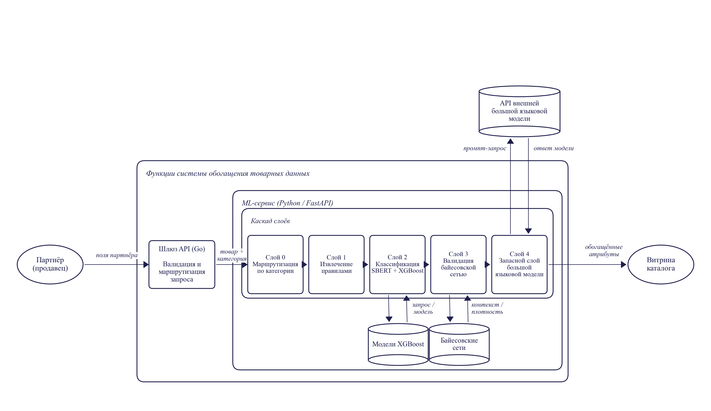

# Глава 2. Теоретическое обоснование решения

В главе формально описывается разрабатываемая система и обосновываются принятые архитектурные решения. Сначала приводится формальная постановка задачи и логика работы программного обеспечения (2.1). Затем рассматриваются архитектура и стек технологий, а также обоснование выбора каждой компоненты (2.2). В конце разбирается логика прохождения типового запроса через систему (2.3).

## 2.1 Логика работы разрабатываемого программного обеспечения

### 2.1.1 Формальная постановка задачи обогащения

Пусть товарная позиция, поступающая в систему от партнёра, представлена кортежем партнёр-доступных полей

$$x = (x^{\text{name}}, x^{\text{brand}}, x^{\text{ingr}}, x^{\text{qty}}),$$

где $x^{\text{name}}$ — название, $x^{\text{brand}}$ — бренд, $x^{\text{ingr}}$ — состав, $x^{\text{qty}}$ — количество. Любое поле, кроме названия, может быть пустым. Задача — восстановить структурированные характеристики по этому минимуму.

Каждому товару ставится в соответствие категория $c \in \mathcal{C} = \{c_1, \dots, c_M\} \cup \{\text{OOD}\}$ ($M = 3$: pasta, chocolate, cheeses; метка OOD — выход за пределы поддерживаемых доменов). Категорию определяет отдельная модель

$$c = f_0(x),$$

(Слой 0, см. 2.2.1). Для каждой категории задана схема $\mathcal{A}_c = \{a_1, \dots, a_{K_c}\}$ с областями $\mathcal{Y}_k$; система строит

$$\hat{y} = (\hat{y}_1, \dots, \hat{y}_{K_c}) \in (\mathcal{Y}_1 \cup \{\text{null}\}) \times \dots \times (\mathcal{Y}_{K_c} \cup \{\text{null}\}),$$

где $\hat{y}_k = \text{null}$ — явный отказ системы от ответа. Честное молчание предпочтительнее неверного заполнения: повторное обращение к оператору дешевле ошибки на витрине. Опорное эталонное значение — $y_k^{(i)}$; товары с известным эталоном образуют проверочную выборку (2.1.4).

### 2.1.2 Каскадная схема принятия решения

Логика обогащения реализована как каскад из четырёх содержательных слоёв; ему предшествует определение категории. Для каждого атрибута $k$ итоговое предсказание формируется по правилу

$$
\hat{y}_k =
\begin{cases}
f_k^{\text{regex}}(x), & f_k^{\text{regex}}(x) \neq \varnothing; \\[4pt]
f_k^{\text{ML}}(x), & f_k^{\text{regex}}(x) = \varnothing,\ P_{\text{ML}}(\hat{y}_k \mid x) \geq \tau_k,\ P_B(\hat{y}_k \mid \mathbf{e}) \geq \theta_k; \\[4pt]
f_k^{\text{LLM}}(x), & \text{otherwise}.
\end{cases}
$$

В первой строке экстрактор регулярных выражений нашёл значение; во второй — экстрактор отказался, но классификатор и валидатор согласились с заданным уровнем уверенности; в третьей строке (`otherwise`) ни одно из условий выше не выполнено, и ячейка передаётся на запасной слой.

Используются следующие обозначения:

- $f_k^{\text{regex}}$ — экстрактор регулярных выражений (Слой 1), детерминированная функция от текстовых полей. Слой считается несработавшим, если ни один шаблон не дал совпадения;
- $f_k^{\text{ML}}$ — классификатор машинного обучения (Слой 2) над многоязычным векторным представлением партнёр-доступных полей;
- $P_{\text{ML}}(\hat{y}_k \mid x)$ — апостериорная вероятность класса по оценке классификатора после калибровки;
- $\tau_k$ — поатрибутный порог уверенности классификатора, подобранный на отложенной части обучающей выборки;
- $P_B(\hat{y}_k \mid \mathbf{e})$ — оценка вероятности предсказанного значения по обученной байесовской сети при свидетельствах $\mathbf{e} = (x^{\text{brand}}, \hat{y}_{j \neq k})$. Свидетельствами выступают известный бренд и уже сформированные предсказания других атрибутов товара;
- $\theta_k$ — поатрибутный порог байесовского валидатора. В реализации он задаётся как пятый перцентиль распределения $P_B$ по обучающим примерам с верной разметкой;
- $f_k^{\text{LLM}}$ — обращение к большой языковой модели в роли запасного слоя (Слой 4). Возвращает либо значение из $\mathcal{Y}_k$, либо $\text{null}$.

Предсказание Слой 2 принимается тогда и только тогда, когда одновременно выполнены

$$
\bigl[P_{\text{ML}}(\hat{y}_k \mid x) \geq \tau_k\bigr] \ \wedge\ \bigl[P_B(\hat{y}_k \mid \mathbf{e}) \geq \theta_k\bigr].
$$

Это конъюнктивное условие реализует многоуровневую фильтрацию по уверенности и формализует требование темы об ансамблевой оценке уверенности — не параллельное голосование, а последовательная фильтрация, где каждый слой имеет калиброванный порог и вправе отказаться, передав решение следующему слою.

Условие $P_B \geq \theta_k$ задаёт общую форму. По итогам 3.3.4 в финальную конфигурацию валидатор включён селективно: активен только на парах «категория — атрибут» с неотрицательным приростом, иначе порог $\theta_k$ устанавливается так, что условие не отсекает Слой 2.

Схема обладает тремя полезными свойствами: (1) стратифицированное решение — простые случаи закрываются дешёвым Слой 1, средние — Слой 2, трудный остаток — дорогим Слой 4; слои упорядочены по росту стоимости. (2) Композициональная отбраковка — валидатор работает после классификатора, отбраковывая статистически невероятные пары «бренд × значение» (закрывает требование темы об автоматической отбраковке). (3) Архитектурная объяснимость — для каждого предсказания известно, какой слой принял решение, что даёт локальную интерпретируемость даже при черноящичном классификаторе в середине.

### 2.1.3 Поведение системы при выходе категории за пределы поддерживаемых

Слой 0 определяет $c = f_0(x)$ до запуска каскада. Если достоверность ниже порога OOD-детектора, товару присваивается метка OOD и система возвращает «категория не поддерживается»: $f_0(x) \in \mathcal{C} \setminus \{\text{OOD}\} \Rightarrow$ запуск per-category каскада со схемой $\mathcal{A}_{f_0(x)}$; $f_0(x) = \text{OOD} \Rightarrow \hat{y} = \varnothing$. Явный отказ выбран по соображениям эксплуатационной безопасности: ошибочное отнесение к чужой категории даёт неверную схему всем атрибутам, что заметно хуже честного отказа.

### 2.1.4 Метрики качества и стоимости

Каскад поддерживает явный отказ от ответа; используются две согласованные метрики и одна сводная.

Точность на покрытой части — доля верных предсказаний среди ячеек с непустым ответом:

$$
\text{acc}_k^{\text{cov}} = \frac{\bigl|\{i : \hat{y}_k^{(i)} = y_k^{(i)} \ \wedge\ \hat{y}_k^{(i)} \neq \text{null}\}\bigr|}{\bigl|\{i : \hat{y}_k^{(i)} \neq \text{null}\}\bigr|}.
$$

Покрытие (coverage) — доля ячеек, на которых система решилась дать ответ:

$$
\text{cov}_k = \frac{\bigl|\{i : \hat{y}_k^{(i)} \neq \text{null}\}\bigr|}{N},
$$

где $N$ — мощность проверочной выборки.

Сквозная точность (end-to-end accuracy). Чтобы предотвратить искусственное завышение качества за счёт молчания, ячейки с $\hat{y}_k^{(i)} = \text{null}$ засчитываются как неверные:

$$
\text{acc}_k^{\text{e2e}} = \text{acc}_k^{\text{cov}} \cdot \text{cov}_k.
$$

Сквозная точность является основной метрикой работы и используется в качестве заголовочного числа (3.3.2). Раздельный учёт $\text{acc}^{\text{cov}}$ и $\text{cov}$ необходим для добросовестного сравнения каскада с конфигурациями, в которых отказ от ответа невозможен. К таким конфигурациям относится, например, сценарий end-to-end LLM.

Стоимость. В качестве архитектурной метрики стоимости используется ожидаемая доля вызовов запасного слоя, нормированная на 1000 обработанных ячеек:

$$
\text{cost}_{\text{LLM}} = \frac{1000}{N \cdot K_c} \sum_{i=1}^{N} \sum_{k=1}^{K_c} \mathbb{1}\bigl[\hat{y}_k^{(i)} \text{ получен через } f_k^{\text{LLM}}\bigr].
$$

Метрика инвариантна к выбору модели запасного слоя и характеризует структуру каскада. Для экономического сопоставления (3.3.2) она умножается на удельную стоимость провайдера и нормируется относительно стратегии «все ячейки решаются Sonnet 4.5». Совместный анализ $(\text{acc}^{\text{e2e}}, \text{cost}_{\text{LLM}})$ образует матрицу «точность — стоимость», на которой строится заголовочный результат (3.3.2).

## 2.2 Архитектура и стек технологий

В разделе описывается архитектурное решение, реализующее формальную постановку 2.1, и обосновывается выбор каждой компоненты стека.

### 2.2.1 Архитектура системы

Функциональная модель системы в виде диаграммы потоков данных приведена на рисунке 2.1. Внешние акторы (партнёр-продавец и витрина каталога интернет-магазина) обмениваются данными со шлюзом API и ML-сервисом, который содержит каскад из пяти слоёв и обращается к хранилищам моделей XGBoost, байесовских сетей и внешнему API большой языковой модели.

Рисунок 2.1 — Функциональная модель системы обогащения товарных данных

Система реализована как пятислойный конвейер (Слой 0 + четыре содержательных слоя). Состав и роль каждого слоя:

- **Слой 0 — категорайзер.** LightGBM поверх TF-IDF-представления названия и бренда с порогом OOD; определяет $c \in \mathcal{C}$ либо относит к OOD.
- **Слой 1 — экстрактор регулярных выражений.** Извлекает значения, явно присутствующие в тексте (форма пасты, % какао, цельнозерновой, шаблоны количества). Применяется только к шаблонам с высокой точностью совпадения.
- **Слой 2 — классификатор машинного обучения.** Основной слой: партнёр-доступные поля конкатенируются и кодируются SBERT в 384-мерный вектор; поатрибутный XGBoost с порогом $\tau_k$ на отложенной выборке. Изотоническая пост-калибровка исследована в двух режимах (3.3.3.3): серебряная деградирует на эталоне из-за дрейфа; перекрёстная на эталонной выборке даёт улучшение ECE с 0,070 до 0,043 (в производственную конфигурацию не включена).
- **Слой 3 — байесовский валидатор.** Сеть (структура — Hill Climb + BIC) вычисляет $P_B(\hat{y}_k \mid \mathbf{e})$; ниже порога $\theta_k$ — флаг и передача дальше. Роль пересмотрена (3.1): не классификатор, а валидатор плотностей.
- **Слой 4 — запасной слой на большой языковой модели.** Взаимозаменяемые модели семейств GPT [41] и Claude [42]: Sonnet 4.5, GPT-4o, Gemini 2.5 Flash, открытая gpt-oss-120b, малая llama-3.2-3b (сопоставление — 3.3.2). Структурированный запрос со схемой и партнёр-доступными полями; возвращает значение или честный отказ.

Слои упорядочены по росту удельной стоимости решения. Regex детерминирован и по существу бесплатен. ML работает на уже вычисленном векторном представлении и потому тоже почти бесплатен. Байесовскому валидатору требуется один inference-вызов на сеть. Запасной слой самый дорогой.

### 2.2.2 Почему каскад, а не сквозное решение

Альтернативы каскаду — крайние конфигурации all-LLM и all-ML — рассмотрены как точки отсчёта и отвергнуты. Сквозное решение на LLM даёт 83–94 % точности (3.3.2), но стоимость линейно растёт с числом ячеек; каскад экономит порядка двух порядков при равной или большей точности за счёт стратифицированного распределения нагрузки. Сквозное решение на классическом ML не подходит из-за производных атрибутов, требующих знаний за пределами товарного описания, и сценария холодного старта новых категорий. Каскад занимает нишу между двумя крайностями.

### 2.2.3 Почему SBERT, а не BERT или RoBERTa

В качестве кодировщика выбран `paraphrase-multilingual-MiniLM-L12-v2` (SBERT [20]). Обоснование: бесплатная многоязычность (50+ языков в едином пространстве без дообучения); компактное 384-мерное представление (в 2 раза меньше BERT-768 и в 2,7 раза меньше RoBERTa-large-1024) при сохранении качества по [20]; готовность к работе без доменной адаптации (контрастивное обучение на парафразах хорошо подходит для классификации по семантической близости).

### 2.2.4 Почему XGBoost, а не нейронная сеть

Слой 2 — XGBoost [14] с регуляризацией (subsample=0.8, colsample=0.8, ранняя остановка, gamma=0.1). XGBoost устойчиво работает на плотных векторных признаках при ограниченной разметке (n≈1250 на категорию, см. 3.2.1), допускает пост-калибровку изотонической регрессией [28] и выполняет inference на CPU за миллисекунды без GPU. Поатрибутная архитектура «по одному классификатору на атрибут» упрощает цикл «аудит — правка — переобучение — измерение» (3.3.6).

### 2.2.5 Почему байесовская сеть и почему именно pgmpy

Для валидатора плотностей выбрана дискретная байесовская сеть в реализации pgmpy [35] 1.1.2. В сравнении с MRF и автоэнкодерами она допускает структурное обучение (Hill Climb + BIC [36]) с интерпретируемым ориентированным графом, дешёвый вывод через Variable Elimination и явное выражение условных зависимостей. pgmpy выбрана за совместимость с Python-экосистемой и поддержку как структурного обучения, так и параметрической оценки через `BayesianEstimator`.

### 2.2.6 Почему шлюз API на языке Go, а не моноязычный Python

Демо-система — два сервиса: шлюз на Go (`:8080`) и ML-сервис на Python/FastAPI (`:8001`). Go подходит для сетевого ввода-вывода (малое потребление памяти, быстрый запуск, конкурентный I/O); Python-экосистема (PyTorch, sentence-transformers, XGBoost, pgmpy) безальтернативна для ML-инференса. Разделение соответствует типовой production-архитектуре и позволяет масштабировать компоненты независимо.

### 2.2.7 Почему открытая большая языковая модель в качестве запасного слоя

В роли Слой 4 поддерживается набор взаимозаменяемых моделей через OpenRouter: Claude Sonnet 4.5, GPT-4o, Gemini 2.5 Flash, открытая gpt-oss-120b, открытая малая llama-3.2-3b (сопоставление — 3.3.2). Обоснование многомодельной конфигурации: открытую gpt-oss-120b можно запустить в инфраструктуре заказчика без передачи данных вовне; коммерческие LLM взаимозаменяемы, что снижает зависимость от провайдера; каскад компенсирует слабость малой модели — при самостоятельном применении gpt-oss-120b проигрывает Sonnet 14–15 п. п., но в составе каскада превосходит безусловное обращение к ней на 23,0 п. п. (3.3.2).

### 2.2.8 Стек технологий — сводная таблица

Сводное представление принятых решений приведено в таблице 2.1.

| Компонент | Технология | Ключевое обоснование |
|---|---|---|
| Шлюз API | Go, стандартная библиотека net/http | Малое потребление ресурсов, быстрый запуск, отсутствие внешних зависимостей |
| ML-сервис | Python 3.14, FastAPI, Uvicorn | Доступ к ML-экосистеме, автоматическая валидация через Pydantic, поддержка OpenAPI |
| Векторное представление | SBERT `paraphrase-multilingual-MiniLM-L12-v2` | Многоязычность (50+ языков), компактный 384-мерный вектор, отсутствие необходимости в fine-tuning |
| Классификатор Слой 2 | XGBoost с регуляризацией; перекрёстная изотоническая калибровка на эталонной выборке снижает среднюю ECE с 0,070 до 0,043 (3.3.3.3), внедрение в производственную конфигурацию вынесено в 5.5 | Устойчивость на плотных признаках, калибруемые вероятности, дешёвый вывод |
| Байесовская сеть | pgmpy 1.1.2, `DiscreteBayesianNetwork` | Структурное обучение Hill Climb + BIC, дешёвый inference (Variable Elimination), интерпретируемый граф |
| Категорайзер Слой 0 | LightGBM (поверх TF-IDF-представления) + порог OOD | Multi-class классификация с вероятностями + явный отказ при низкой уверенности |
| Запасной слой | OpenRouter API: Sonnet 4.5, GPT-4o, Gemini 2.5 Flash, gpt-oss-120b, llama-3.2-3b | Единый интерфейс, возможность локального развёртывания, независимость от поставщика |
| Фронтенд | HTML/CSS/JavaScript без сборочной системы | Минимальные требования к окружению, прозрачность демонстрации |

*Таблица 2.1. Сводная таблица стека технологий с обоснованием выбора.*

## 2.3 Сценарий работы программного обеспечения

### 2.3.1 Сквозной пример прохождения запроса

Прохождение рассматривается на примере *Spaghetti #5 Barilla* (повторяется в 3.1.2). Партнёр шлёт `POST /api/enrich` с полями category=null, product_name="Spaghetti #5 Barilla", brands="Barilla", ingredients_text="Durum wheat semolina, water", quantity="500g". Поле category пустое — категоризация делегирована системе.

**Шаг 1. Определение категории (Слой 0).** Возвращает $c = \text{pasta}$ с уверенностью $0{,}97$; OOD не активирован, выбрана схема $\mathcal{A}_{\text{pasta}}$ (8 атрибутов).

**Шаг 2. Поочерёдная обработка атрибутов.** Каскад обходит атрибуты по схеме. Для pasta_shape срабатывает шаблон Слой 1 на «spaghetti» с уверенностью $1{,}0$ — следующие слои не вызываются. Для grain_type Слой 1 не даёт совпадения; Слой 2 выдаёт `"wheat"` с $P_{\text{ML}} = 0{,}99 \geq \tau = 0{,}5$, валидатор подтверждает ($P_B = 0{,}85 \geq \theta = 0{,}04$) — отметка ml. Для nutri_score_grade — класс `"A"`, $P_{\text{ML}} = 0{,}83$, валидатор подтверждает. Для is_filled $P_{\text{ML}} = 0{,}45 < \tau$ — ячейка идёт в Слой 4.

**Шаг 3. Формирование ответа.** ML-сервис собирает поатрибутный ответ с агрегированными счётчиками и возвращает JSON шлюзу (формат — 3.1.2). В сценарии 7 из 8 атрибутов закрыты дешёвыми слоями (1 regex + 6 ML), 1 — Слой 4. Именно такое распределение обеспечивает доминирование каскада в матрице «точность — стоимость» (3.3.2).

## 2.4 Выводы по главе

1. Задача обогащения формализована как поатрибутное предсказание $\hat{y}_k$ при заданных партнёр-доступных полях и определённой Слой 0 категории; логика — последовательная фильтрация по уверенности, предсказание классификатора принимается при одновременном выполнении $P_{\text{ML}} \geq \tau_k$ и $P_B \geq \theta_k$ (формализация ансамблевой оценки уверенности как AND-условия, а не параллельного голосования).
2. Архитектурный выбор каждой компоненты (каскад вместо сквозного решения; SBERT, XGBoost, pgmpy; Go-шлюз + Python-ML; открытая gpt-oss-120b) обоснован эксплуатационно, методологически и стратегически. Каскад превращает слабую открытую модель в работоспособную часть production-стека.
3. Сквозной сценарий показывает: большинство атрибутов закрывается дешёвыми слоями, обращение к LLM точечно — что и объясняет доминирование по Парето, подтверждаемое в 3.3.