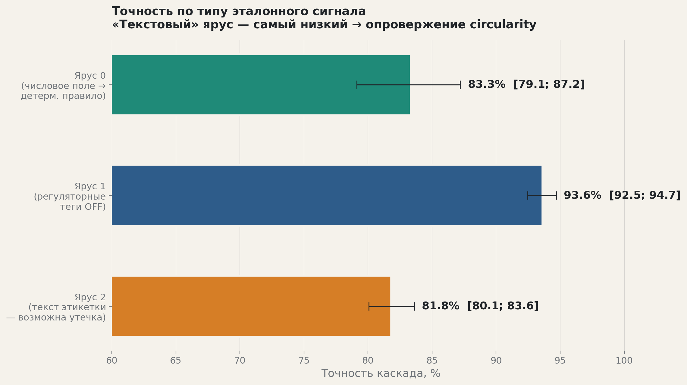
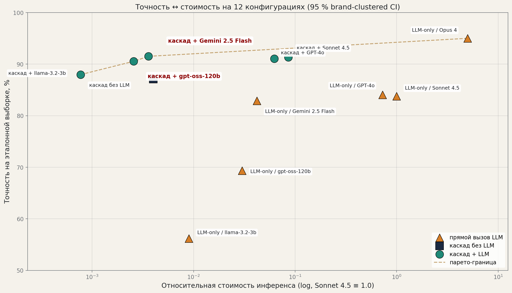
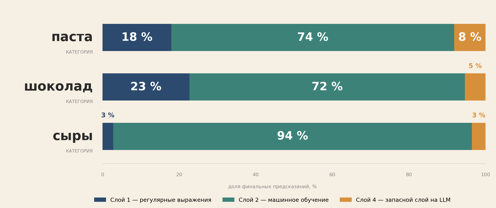

# 3 ОПИСАНИЕ ПРОГРАММНО-ТЕХНОЛОГИЧЕСКОЙ РЕАЛИЗАЦИИ

Глава описывает программную реализацию системы: 3.1 — каскад и демонстрационный комплекс; 3.2 — данные и предобработку; 3.3 — численные результаты и сценарии тестирования.

## 3.1 Описание программного обеспечения

## 3.1.1 Архитектура каскада

Гибридный каскад — последовательность из пяти слоёв; каждый обрабатывает свой класс случаев и передаёт остаток следующему. Архитектура соответствует формальной постановке (2.1) и реализует многоуровневую фильтрацию по уверенности с собственным калиброванным порогом на каждом слое; итоговый вердикт — последовательное AND-условие порогов.

### Состав слоёв

Состав слоёв и их роли описаны в 2.2.1. Ниже приведены детали программной реализации каждого из них; повторное описание архитектурной роли опущено.

**Слой 0 — категорайзер.** Реализован как LightGBM поверх TF-IDF-представления (n-граммы 1–2) с порогом OOD. Артефакты: `models/category_router_v3_lgbm.pkl`, `models/category_router_v3_vec.pkl`, `models/category_router_v3_threshold.json`. На итоговую точность системы влияет через штраф маршрутизации: при ошибке в категории атрибуты товара получают неверную схему и засчитываются как неверные предсказания.

**Слой 1 — экстрактор регулярных выражений.** Реализация — `src/pipeline/regex/extractor.py`. Разбирает поля product_name и quantity; распознаёт формы пасты («spaghetti», «penne»), процент какао («70 % cocoa» — класс «70–85»), индикатор цельнозернового состава, международные шаблоны вроде «300 g», источник молока в сырах (chèvre / brebis / bufala → goat / sheep / buffalo), маркеры защищённого наименования (AOP / AOC / DOP / PDO / IGP), явные индикаторы ультра-обработанного сыра (fondu, processed cheese, Schmelzkäse). Покрытие слоя неоднородно по категориям: около 18 % на pasta, 23 % на chocolate и 3 % на cheeses (доменные сигналы текстуры и страны происхождения сыра плохо параметризуются регулярными выражениями и переданы на ML-слой). Точность на закрытых ячейках — 87,0–100 % в зависимости от шаблона; на cheeses-выборке gold-эталона все три cheese-шаблона дают 100 % precision (47/47, аудит false-positive исключил формы нарезки «slices / tranches» как маркеры обработки). См. 3.3.3.2.

**Слой 2 — классификатор машинного обучения.** Основной рабочий слой (72–96 % решений по категориям). На вход подаётся конкатенация `product_name + brands + ingredients_text + quantity`. SBERT-кодировщик `paraphrase-multilingual-MiniLM-L12-v2` (50+ языков) даёт 384-мерный вектор. Для каждой пары (категория, атрибут) обучен XGBoost-классификатор `{cat}_{attr}_xgb_hybrid.pkl` с регуляризацией (subsample=0.8, colsample=0.8, ранняя остановка). Пороги уверенности — в `{cat}_thresholds.pkl`. При вероятности ниже порога слой отказывается отвечать. Точность на покрытом срезе — 94,9–98,6 % (см. 3.3.3.2).

**Слой 3 — байесовский валидатор.** Сеть хранится в `models/{cat}_stratified_bayesian.pkl`; структура — Hill Climb + BIC. Роль пересмотрена по итогам 3.3.4: классификаторная точность сети на трудном остатке после Слой 2 — около 52 %, ниже мажоритарной точки отсчёта. Поэтому сеть используется как валидатор плотностей: для предсказания Слой 2 вычисляется `P(value | evidence)`, при попадании в нижний 5-перцентиль ячейка помечается флагом и понижается на следующий слой.

**Слой 4 — запасной слой на большой языковой модели.** Реализация — `src/pipeline/llm_fallback/enrich.py`. Оценке в 3.3.2 подлежат пять моделей: Claude Sonnet 4.5, GPT-4o, Gemini 2.5 Flash, открытая gpt-oss-120b через OpenRouter и открытая малая llama-3.2-3b. Промпт содержит схему атрибутов категории, требуемый JSON-формат и партнёр-доступные поля без подсказок об ожидаемом значении.


### Поток управления и вход/выход

Поток управления описан в 2.1 (формула $\hat{y}_k$). На каждом слое одно из двух решений: закрыть атрибут или передать дальше. Слои упорядочены по росту стоимости, поэтому LLM-вызов делается только на ячейках, где предыдущие слои отказались. Вход — партнёр-доступные поля; Слой 2 обучается только на них, что исключает утечку через теги OFF.

## 3.1.2 Демонстрационная система

Трёхкомпонентная демонстрационная система имитирует встраивание в бизнес-процесс интернет-магазина.

### Архитектура компонентов

Цепочка обработки: браузер (HTML/JS) → шлюз API на Go (`:8080`) → ML-сервис на Python/FastAPI (`:8001`) → каскад Слой 0 — regex — ML — Bayes — LLM.

Шлюз на Go (demo/gateway/, ≈200 строк, стандартная net/http) выполняет валидацию JSON, проксирование к ML-сервису, CORS, логирование и отдачу статического фронтенда. ML-сервис (demo/ml_service/) при старте загружает SBERT-кодировщик, 24 XGBoost-классификатора, байесовские сети, словари порогов и Слой 0; после прогрева (≈15–20 с) запросы к слоям 0–3 обрабатываются за десятки миллисекунд. Эндпоинты: `POST /api/enrich` (обогащение), `GET /api/categories` (схема), `GET /health` (готовность), `POST /api/explain` (Shapley-объяснения). Веб-интерфейс (demo/frontend/) — статическая HTML/JS-страница с формой ввода, переключателем категоризации, пресетами и блоком результата с отметкой слоя-источника.

### Контракт API

Запрос `POST /api/enrich` принимает JSON с полями category (опционально; иначе сработает Слой 0), product_name, brands, ingredients_text, quantity. Пример:

```json
{ "category": "pasta", "product_name": "Spaghetti #5 Barilla",
  "brands": "Barilla", "ingredients_text": "Durum wheat semolina, water", "quantity": "500g" }
```

Ответ содержит category, агрегированные счётчики (n_attrs_total, n_covered, n_llm_fallback) и объект predictions, где для каждого атрибута указаны значение, слой-источник (regex / ml / llm_fallback), уверенность и результат валидации:

```json
{ "category": "pasta", "n_attrs_total": 8, "n_covered": 7, "n_llm_fallback": 1,
  "predictions": {
    "pasta_shape": { "value": "spaghetti", "layer": "regex", "confidence": 1.00 },
    "grain_type":  { "value": "wheat", "layer": "ml", "confidence": 0.99,
                     "validation": { "flagged": false, "p": 0.85, "threshold": 0.04 } },
    "is_filled":   { "value": null, "layer": "llm_fallback", "confidence": 0.0 } } }
```

Явная отметка слоя-источника компенсирует ограниченную интерпретируемость Слой 2/3 на уровне отдельного товара.

### Запуск и эксплуатация

Запуск выполняется тремя командами (ML-сервис на `:8001`, Go-шлюз на `:8080`, браузер) либо одной — `bash reproduce.sh demo`. Готовность системы проверяется через `GET /health`. Стек технологий и обоснование компонентов — в 2.2.8 (таблица 2.1).

## 3.2 Данные

### 3.2.1 Источник данных: Open Food Facts

Основой выбран открытый каталог Open Food Facts (далее — OFF) — краудсорсинговая база ≈4,5 млн уникальных позиций под лицензией Open Database License (ODbL), допускающей коммерческое использование. Дамп получен командой `python -m src.data.download --source off` и конвертирован в parquet (`datasets/raw/en.openfoodfacts.org.products.parquet`, 526 МБ).

Выбор OFF обоснован тремя соображениями: открытость лицензии обеспечивает воспроизводимость; каталог репрезентативен и мультиязычен (50+ языков в product_name и ingredients_text); помимо текстовых полей OFF содержит структурированные нутриентные показатели (fat_100g, sugars_100g и др.) и регуляторные теги (labels_tags, ingredients_analysis_tags), на которых построен эталон (3.2.3). Альтернативы (скрейпинг онлайн-магазинов, коммерческие PIM, теги Wikipedia) отклонены по лицензионным и покрытийным соображениям.

Область охвата — три категории: pasta, chocolate, cheeses. Они выбраны по критериям 1.3: достаточный объём, различие типа целевых атрибутов и наличие подгруппы атрибутов с детерминированным эталоном из нутриентов.

### 3.2.2 Входные и целевые поля, фильтрация, стратифицированная выборка

Поля OFF разделены на партнёр-доступные (product_name, brands, quantity, ingredients_text, code) и целевые выходные (categories_tags, labels_tags, `*_100g`, ingredients_analysis_tags). Целевые поля не передаются на вход обучаемых компонентов под угрозой утечки; Слой 2 формирует вход только из конкатенации `product_name + brands + ingredients_text + quantity`.

Фильтрация по категории (`src/data/filter.py`) использует списки включения/исключения categories_tags (например, для pasta включение — `en:pastas`, `en:fresh-pastas`, исключение — `en:potato-products`, `en:rice-products`, `en:noodles`). После фильтрации применяется стратифицированная по языку выборка (определение языка — langdetect, страты — FR, EN, DE, IT, ES). Из каждой страты отбирается ≈250 товаров, итого ≈1250 на категорию (таблица 3.2.1).

Таблица 3.2.1. Состав стратифицированной выборки по категориям, входящим в область охвата работы. Источник: `datasets/processed/{cat}_stratified_silver_standard.parquet`.

| Категория | Объём после фильтрации (сырые позиции) | Объём стратифицированной выборки | Число целевых атрибутов |
|:---|---:|---:|---:|
| pasta (макаронные изделия) | 15 691 | 1 250 | 8 |
| chocolate (шоколад) | 13 469 | 1 250 | 7 |
| cheeses (сыры) | 21 208 | 1 250 | 9 |

Целевые атрибуты определены в `src/pipeline/schemas/{cat}.py` и включают как кросс-категорийные (is_organic, nutri_score_grade), так и специфичные (pasta_shape, chocolate_type, milk_source, texture). Всего 24 пары (категория, атрибут) для 18 уникальных имён; экспериментальной оценке в 3.3 подлежат 22 пары (два атрибута cheeses — nutri_score_grade, protein_class — обучены, но не оцениваются ввиду отсутствия соответствующей разметки в OFF).

### 3.2.3 Эталонная разметка: иерархическая схема трёх ярусов

Эталонная разметка построена как многоярусная процедура, где каждый ярус опирается на качественно различный класс свидетельств. Это даёт высокую точность при объёме, недостижимом для ручной разметки, и явно отделяет детерминированно разрешимые атрибуты от семантических (таксономия — в приложении A).

Ярус 0 (нутриент-производные). Детерминированное бакетирование числовых полей: nutri_score_grade из `*_100g` по регламенту ЕК 2017/1944, protein_class из proteins_100g, fat_class из fat_100g. Точность эталона — 100 % при достоверных нутриентах, покрытие 95–100 %.

Ярус 1 (тег-производные). Эталон из регуляторных тегов: is_organic из `en:organic`, is_gluten_free из `en:gluten-free`, is_pdo из `en:protected-designation-of-origin`. Достоверность опирается на правовую защиту меток в ЕС (регламенты 834/2007 и 1151/2012).

Ярус 2 (семантически-текстовые). Признаки без детерминированного правила: pasta_shape, chocolate_type, milk_source, texture, contains_nuts, cocoa_percentage. Эталон — согласие трёх независимых LLM (Claude Sonnet 4.5, GPT-4o, Gemini 2.5 Flash) на полной выборке 1250 × 3 категории: атрибут принимается, если не менее двух моделей совпадают (согласованность 97,7 %). Несогласованные позиции размечены слепо Claude Opus 4. Итог (`consensus_gold_v2_expanded.parquet`) — 19 551 ячейка: 4 444 (ярус 0) + 7 108 (ярус 1) + 7 999 (ярус 2).

### 3.2.4 Разбиение без пересечения брендов

Случайное разбиение непригодно: бренд сам по себе сильный предиктор атрибутов (например, «Lindt» — тёмный шоколад определённого диапазона какао), и его попадание в обучение и тест одновременно завышает точность за счёт утечки. Эксплуатационный сценарий с регулярным подключением новых партнёров такая оценка не отражает.

Применяется разбиение без пересечения брендов (`src/data/split/brand_disjoint.py`): уникальные бренды каждой категории делятся 60/20/20, все позиции бренда — в одно подмножество. Тест: 170 / 163 / 188 брендов в pasta / chocolate / cheeses; совокупно 1 423 / 1 270 / 1 657 = 4 350 ячеек (`headline_v3e_final.parquet`). Этот срез — основа всех количественных оценок 3.3.

### 3.2.5 Дополнительные источники: разнородные модальности и внешний справочник

Для усиления обучающего сигнала Слой 2 задействованы два дополнительных класса данных. Первый — разнородные модальности: фотографии этикеток обработаны OCR (EasyOCR); визуальный кодировщик CLIP [43] (ViT-B/32) даёт 512-мерный вектор, добавляемый ранней конкатенацией к 384-мерному SBERT-представлению. Покрытие изображениями ≈70 %. Второй — внешний справочник USDA Branded Foods [44], сопоставленный с выборкой приближённым поиском по `product_name + brands` (Левенштейн, порог 0,85); даёт независимо измеренные нутриенты для проверки эталона яруса 0.

Оба источника используются только на этапе обучения. В режиме вывода система работает строго с партнёр-доступными полями (3.2.2); это инвариант, соблюдённый во всех оценках 3.3.

## 3.3 Доказательство работоспособности и применимости

## 3.3.1 Условия проверки

### Тестовая выборка

Эксперименты проведены на единой тестовой выборке. Источник эталона — `consensus_gold_v2_expanded.parquet` (схема ярусов — 3.2.3). Состав среза: 3 категории, 22 пары (категория, атрибут), 4350 ячеек после фильтрации непустых эталонных значений (234–239 кодов на категорию); уникальных брендов 170 / 163 / 188 (`headline_v3e_final.parquet`). Разбиение train/val/test без пересечения брендов выполнено в пропорции 60/20/20.

Независимая проверка эталона. Слепая разметка Claude Opus 4 без доступа к тегам OFF и промежуточным меткам проведена на 2666 кодах × 22 атрибута. Согласованность с эталоном — 95,0 % на 4088 ненулевых ячейках (`blind_vs_prefill_overall.parquet`); на 17 из 22 пар согласованность > 92 %, κ Коэна > 0,85. Для трёх нутриент-производных пар Opus в слепом режиме отказывается отвечать в 82–93 % случаев (правило бакетирования требует числовых полей); эталоном там выступает ярус 0.

### Метрики и доверительные интервалы

Метрики ($\text{acc}^{\text{cov}}_k$, $\text{cov}_k$, $\text{acc}^{\text{e2e}}_k$, стоимость) определены в 2.1.4. Доверительные интервалы — кластерный бутстрэп по брендам: 1000 итераций, перцентили 2,5 % и 97,5 % (`src/diagnostics/ml/bootstrap_ci_brand_clustered.py`). Такой интервал учитывает внутрибрендовую корреляцию ошибок и на ряде атрибутов на 15–30 % шире наивного интервала Вильсона.

### Стратификация точности по типу эталонного сигнала

Если бы точность завышалась структурной корреляцией признаков модели с источником эталона, то наиболее уязвимый ярус 2 (текстово-производный) показывал бы наибольшие значения. Результат обратный (таблица 3.3.1.1).

Таблица 3.3.1.1. Точность каскада в разрезе типа эталонного сигнала. Источник: `datasets/processed/tier_breakdown.parquet`.

| Ярус сигнала | Содержательная природа | Атрибутов | Ячеек | Точность, % | 95 % CI |
|---|---|---:|---:|---:|---|
| Ярус 0 (нутриент-производный) | Детерминированное бакетирование числовых полей OFF | 3 | 354 | 83,33 | [79,12; 87,20] |
| Ярус 1 (тег-производный) | Регуляторные теги OFF, защищённые правом ЕС | 6 | 1 912 | 93,62 | [92,45; 94,69] |
| Ярус 2 (текстово-производный) | Согласие трёх LLM с проверкой Opus 4 на спорных | 9 | 2 084 | 81,81 | [80,07; 83,61] |



Рисунок 3.1 — Точность каскада в разрезе ярусов эталонной разметки


Точность на ярусе 2 — наименьшая (81,8 %, на 11,8 п. п. ниже яруса 1). На ярусе 1, где эталон порождён внешним источником (правовые регистры сертификаций), точность наиболее высокая (93,6 %). Это опровергает гипотезу о завышении метрик за счёт зависимости признаков от эталона. На ярусе 0 показатель снижен парой cheeses/fat_class (73,8 %) — классификация жирности сыра объективно сложна.

### Воспроизводимость

Все численные результаты 3.3 регенерируются из артефактов через `reproduce.sh` (≈час на типовом ноутбуке). Численные результаты 3.3.2 получены post-hoc после устранения утечки бренда и не претендуют на предзарегистрированный статус. Единственной предзарегистрированной гипотезой является H1 для обучаемого маршрутизатора (3.3.5).

## 3.3.2 — Главный результат: точность и стоимость производственной конфигурации

Подраздел представляет центральный количественный результат: каскад сопоставлен с пятью одиночными вызовами LLM разной мощности и стоимости. На едином тестовом срезе без пересечения брендов показано доминирование каскада по Парето сразу по двум осям. Тем самым результат стоимостно-чувствительных каскадов LLM (FrugalGPT [9], AutoMix [10], Hybrid LLM [11]) расширяется на задачу обогащения каталогов; впервые количественно фиксируется выигрыш для открытой малой модели в роли запасного слоя.

### 3.3.2.1 — Состав, условия проверки и матрица «точность–стоимость»

Оценка на 4350 ячейках без пересечения брендов (3.3.1); по атрибутам pasta/nutri_score_grade и pasta/protein_class срез сокращён до 21 и 24 ячеек из-за полноты нутри-разметки в OFF. В роли Слой 4 и базовой «одна LLM на всё» — пять моделей: Claude Sonnet 4.5, GPT-4o, Gemini 2.5 Flash (закрытые), gpt-oss-120b и llama-3.2-3b (открытые).

Сводная таблица фиксирует сквозную точность и относительную стоимость десяти стратегий: пять одиночных LLM, пять каскадных конфигураций с теми же моделями и базовый каскад без LLM. Стоимость нормирована к «все ячейки решаются Sonnet 4.5»; соотношение токенов вход/выход — ≈500 / 200; тарифы — в подписи. Источник: `grand_acc_summary_after_fix.parquet`. Каскад покрывает 96,7 % ячеек, LLM делается на 3,3 % — множитель 0,033 относительно одиночной LLM.

| Стратегия | Сквозная точность | Стоимость к опорной | Снижение стоимости |
|---|---:|---:|---:|
| all-sonnet (Claude Sonnet 4.5) — опорная конфигурация | 83,79 % | 1,000 | 1× |
| all-gpt-4o | 84,05 % | 0,727 | 1,4× |
| all-gemini-flash (Gemini 2.5 Flash) | 82,90 % | 0,042 | 24× |
| all-gpt-oss-120b (открытая модель) | 69,34 % | 0,030 | 33× |
| all-llama-3b (открытая малая модель) | 56,19 % | 0,009 | 110× |
| каскад + sonnet (Слой 4) | 92,78 % | 0,033 | 30× |
| каскад + gpt-4o | 92,90 % | 0,024 | 42× |
| каскад + gemini-flash | 92,78 % | 0,0014 | 720× |
| каскад + gpt-oss-120b | 92,32 % | 0,0010 | 1007× |
| каскад + llama-3b | 91,87 % | 0,0003 | 3356× |
| только каскад (без запасного слоя LLM) | 90,48 % | 0,000 | — |

Источники тарифов: Sonnet 4.5 — 3 / 15 долларов за миллион токенов на вход / выход (нормализованная единица), GPT-4o — 2,5 / 10, Gemini 2.5 Flash — 0,075 / 0,30, gpt-oss-120b через OpenRouter — около 0,10 долларов за миллион токенов на запрос смешанной структуры, llama-3.2-3b через OpenRouter — около 0,03 долларов за миллион.



Рисунок 3.2 — Матрица «точность — стоимость» каскадных конфигураций и одиночных вызовов больших языковых моделей

Из матрицы (рис. 3.2) следует двухчастный главный результат.

**Часть (а) — независимость от поставщика модели.** Каскад + Gemini 2.5 Flash даёт 92,78 % при стоимости в 720 раз ниже all-sonnet (83,79 %) — прирост +9,0 п. п. при снижении стоимости на два порядка; строгое Парето-доминирование. Результат сохраняется на любой модели верхнего сегмента: каскад + sonnet (92,78 %) и каскад + gpt-4o (92,90 %) также превосходят одиночный вызов той же модели по обеим осям.

**Часть (б) — сценарий локального развёртывания с открытой моделью.** Каскад + gpt-oss-120b — 92,32 %, на +23,0 п. п. выше одиночного вызова (69,34 %); доля обращений к LLM сокращается ≈в 30 раз. Каскад компенсирует слабость малой модели на нутриент-производных атрибутах (nutri_score_grade, protein_class, fat_class) за счёт Слой 2, оставляя Слой 4 только сложные семантические случаи.

### 3.3.2.3 — Декомпозиция по категориям

Покрытие каскада, точность только-каскадной и гибридной конфигураций и разность Δ — вклад запасного слоя — для модели gemini-flash в таблице 3.3.2.2. Источники: `headline_v3e_after_fix.parquet` + `cascade_plus_llm4_hybrid.parquet`; режим идеальной маршрутизации.

Таблица 3.3.2.2 — Покрытие и точность каскадной и гибридной конфигураций по категориям (модель gemini-flash, идеальная маршрутизация Слоя 0)

| Категория | Покрытие каскада | Только каскад | каскад + gemini-flash | Δ от запасного слоя |
|---|---:|---:|---:|---:|
| pasta | 97,1 % | 93,3 % | 95,8 % | +2,5 п. п. |
| chocolate | 96,4 % | 87,4 % | 90,1 % | +2,7 п. п. |
| cheeses | 96,6 % | 90,4 % | 92,2 % | +1,8 п. п. |

Взвешенное по числу тестовых ячеек 1 423 / 1 270 / 1 657 среднее по строке «каскад + gemini-flash» составляет 92,78 %. Производственное значение с учётом ошибок Слой 0 приблизительно на 2,4 п. п. ниже (3.3.2.6).

Распределение вклада запасного слоя вытекает из архитектуры. Pasta располагает наиболее развитым Слой 1: покрытие каскада 97,1 %, на запасной слой передаются редкие случаи. Cheeses правил Слой 1 не имеет, ячейки покрывает Слой 2 (96,6 %), запасной слой берёт 3,4 % самых сложных текстовых ячеек. Это показывает взаимодополнение слоёв.



Рисунок 3.3 — Поатрибутный вклад слоёв каскада в сквозную точность

### 3.3.2.4 — Поатрибутная картина точности и доверительные интервалы

Для каждого из 22 атрибутов вычислена точность только-каскадной конфигурации с интервалом Вильсона (полная таблица — `headline_v3e_after_fix.parquet`). Три лучших: cheeses/milk_source 99,2 % (n=238, [96,99; 99,77]), pasta/is_filled 98,7 % (n=239, [96,38; 99,57]), pasta/is_gluten_free 98,3 % (n=239, [95,78; 99,35]). Три худших: chocolate/protein_class 52,4 % (n=42, [37,72; 66,64]), cheeses/fat_class 63,6 % (n=225, [57,09; 69,57]), pasta/protein_class 66,7 % (n=24, [46,71; 82,03]).

В 3.3.7.4 описаны поатрибутные архитектурные решения (сужение Слой 1, понижение порогов Слой 2, гибридные признаки). Запасной слой остаётся доступным на ≈3 % сложных ячеек, где Слой 1/2 не отвечают уверенно: pasta/protein_class, chocolate/protein_class, cheeses/fat_class.

### 3.3.2.5 — Анализ доминирования по Парето: почему каскад превосходит одиночный вызов LLM

Доминирование каскада объясняется структурно. LLM системно проигрывает на производных числовых атрибутах: точность Sonnet 4.5 на chocolate/cocoa_percentage — 67,2 %, на cheeses/fat_class — 26,2 % (`cascade_plus_llm4_hybrid.parquet`). Причина — метки этих атрибутов определяются бакетированием числовых полей, которых в тексте нет. XGBoost Слой 2 на SBERT-эмбеддингах опирается на устойчивые корреляции «бренд — числовое поле». Точность каскада растёт за счёт перенаправления таких атрибутов на ML-слой; стоимость падает за счёт сокращения вызовов LLM до 3,3 % ячеек.

### 3.3.2.6 — Учёт точности маршрутизатора первого уровня

Значения рисунка 3.3 — в режиме идеальной маршрутизации. В производстве категорию определяет Слой 0 (3.1.1) с точностью 96,3 % / 98,5 % / 97,7 % по категориям (`cascade_layer0_eval.parquet`). С учётом ошибок Слой 0 заголовочная точность 92,78 % понижается ≈на 2,4 п. п. равномерно по всем строкам; вывод о доминировании каскада сохраняется.

## 3.3.3 Вклад каждого слоя каскада

Подраздел декомпозирует итоговую точность по слоям: охват, точность на собственном срезе и средняя калибровочная ошибка ECE для Слой 2. Артефакты — `cascade_preds_{pasta,chocolate,cheeses}_v2_gold_hybrid_v3_fixed.parquet`, `headline_v3e_final.parquet`, `ece_calibration_table.parquet`.

### 3.3.3.1 Распределение закрытий по слоям

Закрытие — событие выдачи уверенного ответа без передачи дальше. Доли по слоям (колонка layer в `cascade_preds_*`) — таблица 3.3.3.1. Подсчёт ведётся по всем 24 парам (см. 3.2.2); суммарно 5258 ячеек (больше 4350 из 3.3.1, где отбрасываются непустые эталоны по 22 парам).

| Категория | Слой 1 (regex) | Слой 2 (ML) | Отказ (передача на слой 4) | Всего ячеек |
|---|---:|---:|---:|---:|
| pasta | 18,0 % (344) | 73,8 % (1412) | 8,2 % (156) | 1912 |
| chocolate | 22,7 % (380) | 71,9 % (1203) | 5,4 % (90) | 1673 |
| cheeses | 2,8 % (47) | 93,7 % (1567) | 3,5 % (59) | 1673 |

Распределение неоднородно: pasta и chocolate располагают наиболее полным набором правил (18,0 % и 22,7 % закрытий на Слой 1 соответственно); cheeses имеет узкий набор правил (milk_source / is_pdo / is_ultra_processed) с покрытием 2,8 %, что отражает плохую параметризуемость доменных сигналов сыра (текстура, страна происхождения, класс жирности) регулярными выражениями — эти атрибуты переданы на ML-слой.

### 3.3.3.2 Точность каждого слоя на собственном срезе закрытий

Точность получена сопоставлением `cascade_preds_*` с `consensus_gold_v2_expanded.parquet` (только ненулевые эталоны).

| Категория | Слой 1: точность (n) | Слой 2: точность (n) |
|---|---:|---:|
| pasta | 90,5 % (327) | 98,6 % (1035) |
| chocolate | 87,0 % (370) | 94,9 % (802) |
| cheeses | 100,0 % (47) | 93,5 % (1549) |
| cheeses | — | 96,3 % (1443) |

Точность Слой 1 на закрытых ячейках 87,0–90,5 % (ниже 100 % из-за намеренно широких regex-шаблонов и пограничных значений при бакетировании cocoa_percentage). Точность Слой 2 — 94,9–98,6 %; стабильно выше любого одиночного вызова LLM на той же категории, так как слой работает только на ячейках, прошедших калиброванный порог.

Точность запасного слоя на отказных ячейках оценена через поатрибутную точность LLM, взвешенную по числу отказных ячеек (формула acc_hybrid_proxy в `cascade_plus_llm4_hybrid.parquet`): Gemini 2.5 Flash — 78,8 %, Claude Sonnet 4.5 — 76,7 %, gpt-oss-120b — 67,2 %. Эти значения ниже Слой 1/2 и отражают повышенную сложность отказных ячеек.

### 3.3.3.3 Поатрибутная калибровочная ошибка до и после калибровки

Поатрибутная ожидаемая калибровочная ошибка (ECE) рассчитана по 10 равновеликим бинам (`ece_calibration_table.parquet`). Среднее ECE сырого XGBoost — 0,070 (по 22 замерам); у большинства атрибутов не превосходит 0,08. Повышенная ошибка: cheeses/fat_class (0,22), chocolate/chocolate_type (0,14), chocolate/protein_class (0,11).

Изотоническая пост-калибровка на серебряной выборке локально улучшает проблемные атрибуты (chocolate/chocolate_type −7,8 п. п., cheeses/fat_class −6,0 п. п.), но в среднем по 20 атрибутам ECE ухудшается на +0,012 за счёт деградации на других (chocolate/cocoa_percentage: −26,0 п. п.). Эффект объясняется дрейфом разметки между серебряной (теги OFF) и эталонной (консенсус LLM) выборками.

Для устранения дрейфа проведена изотоническая калибровка на распределении эталонной выборки по схеме 5-кратной перекрёстной валидации: на каждом фолде отображение строится на 4 частях и оценивается на отложенной (`ece_kfold_gold_table.parquet`, `src/diagnostics/ml/ece_kfold_gold.py`). Среднее ECE падает с 0,070 до 0,043 (−2,78 п. п. в среднем), положительный эффект на 18 из 22 атрибутов. Наибольшие улучшения концентрируются на парах с высокой исходной ошибкой: cheeses/fat_class (0,220 → 0,075, −14,5 п. п.), chocolate/chocolate_type (0,139 → 0,052, −8,7 п. п.), chocolate/protein_class (0,111 → 0,041, −7,0 п. п.), pasta/is_organic (0,084 → 0,016, −6,9 п. п.). Ухудшение — у четырёх атрибутов с изначально низкой ECE: cheeses/country_of_origin (0,015 → 0,064), cheeses/is_ultra_processed (0,025 → 0,056), pasta/pasta_shape (0,046 → 0,060), chocolate/contains_nuts (0,055 → 0,058); здесь доминируют выборочные колебания. В производственную конфигурацию калибровка пока не включена (см. 5.5).

Итог: Слой 1 закрывает 2,8–22,7 % ячеек (точность 87,0–100 % в зависимости от категории и шаблона); Слой 2 — 71,9–93,7 % (93,5–98,6 %); Слой 4 — 3,5–8,2 % (67,2–78,8 % в зависимости от модели). Среднее ECE по Слой 2 — 0,070; серебряная пост-калибровка устойчивого эффекта не даёт.

### 3.3.3.4. Обоснование сохранения слоя регулярных выражений: сопоставление с обучаемыми альтернативами

Использование детерминированных правил в качестве Слой 1 — нетривиальный выбор, требующий ручной разработки для каждой категории. Для его количественной фиксации каскад с regex сопоставлен с восемью альтернативами, где Слой 1 заменён обучаемой моделью (`src/experiments/layer1_5_*.py`, `src/experiments/lexicon_regex.py`; артефакты — `layer1_5_optimal.parquet`, `lexicon_regex_comparison.parquet`). Все варианты оценены на едином 80/20-разбиении (seed = 42) по 22 парам.

Таблица 3.3.3.4. Сопоставление каскадных конфигураций с разным первым слоем.
| Вариант | Состав первого слоя (перед основным ML-слоем) | Средняя точность | Δ к «без первого слоя» |
|---|---|---:|---:|
| A | Регулярные выражения (текущая конфигурация) | 83,58 % | +1,38 п. п. |
| B | Без первого слоя (один ML-слой) | 82,20 % | 0 |
| C | Наивный байесовский классификатор на n-граммах | 82,16 % | −0,04 |
| D | Решающее дерево | 82,98 % | +0,78 |
| E | Центроидный классификатор в пространстве n-грамм | 82,22 % | +0,02 |
| F | Логистическая регрессия на n-граммах | 82,23 % | +0,03 |
| L | Обучаемый словарь n-грамм (lexicon) | 83,00 % | +0,80 |
| G | Поатрибутный выбор лучшего метода по перекрёстной проверке | 81,99 % | −0,21 |
| H | Регулярные выражения — решающее дерево — ML (последовательно) | 83,78 % | +1,58 |

Источник — `docs/layer1_5_optimal_recommendation.md`. Из таблицы следуют три вывода.

Во-первых, чистый ML без Слой 1 (B, 82,20 %) уступает текущей конфигурации (A, 83,58 %) на 1,38 п. п. — regex даёт небольшой, но устойчивый прирост.

Во-вторых, ни одна обучаемая альтернатива (C, D, E, F, L) не превосходит regex в роли единственного Слой 1. Регулярные правила формализуют доменное знание (формы пасты, типы зерна, числовые шаблоны какао), не восстанавливаемое из распределения слов: лексические маркеры редки, но однозначны.

В-третьих, единственная статистически превосходящая regex конфигурация — композиция «regex — дерево — ML» (H, +0,20 п. п.). Прирост незначителен и не оправдывает усложнения и поддержки 22 деревьев.

Таким образом, выбор regex как Слой 1 эмпирически обоснован: наибольший прирост среди простых альтернатив при детерминированном выводе и отсутствии переобучения. Предпочтительное развитие — точечное расширение правил по итогам 3.3.7.4.

## 3.3.4. Поведение Bayes-валидатора

### Постановка задачи и калибровка порога

Слой 3 — байесовская сеть над дискретизированными атрибутами и брендом. Эмпирически роль классификатора неэффективна (точность ≈52 %, ниже мажорной точки отсчёта), поэтому сеть применяется как валидатор плотности: для предсказания Слой 2 вычисляется $P(\text{value}\mid\text{evidence})$ при свидетельствах «бренд + остальные атрибуты». Ниже порога — ячейка помечается и передаётся в Слой 4. Порог индивидуален для каждой пары и фиксируется на этапе обучения как 5-перцентиль распределения $P$ на обучающей выборке.

Агрегированные результаты по трём категориям приведены в таблице 3.3.4.1 (`bayes_validator_demote_metric.parquet`).


Таблица 3.3.4.1. Поведение Bayes-валидатора на категориях pasta, chocolate, cheeses.
| Категория | n_ml | Доля помеченных | Точность каскада | Точность отбраковки | Базовая точка отсчёта | Прирост | Полнота |
|---|---:|---:|---:|---:|---:|---:|---:|
| pasta | 1010 | 7,9 % | 98,6 % | 2,5 % | 1,4 % | +1,1 п. п. | 14,3 % |
| chocolate | 772 | 14,1 % | 94,7 % | 20,2 % | 5,3 % | +14,9 п. п. | 53,7 % |
| cheeses | 1436 | 6,1 % | 96,3 % | 1,1 % | 3,7 % | −2,5 п. п. | 1,9 % |

Калибровка работает на pasta и cheeses (7,9 % и 6,1 % помеченных при целевом 5 %). На chocolate доля 14,1 %, почти втрое выше: отклонение объясняется смещением маржинального распределения contains_nuts на тестовых брендах относительно серебряной выборки калибровки (согласуется с 3.3.7).

### Метрика отбраковки и селективность сигнала

Точность отбраковки (precision demote) — $\text{TP}/(\text{TP}+\text{FP})$ среди помеченных. Базовая точка отсчёта — частота ошибок каскада на всех ячейках пары. Прирост (lift) — разность; положительный прирост означает, что валидатор обогащает отправляемую в LLM выборку реальными ошибками. Полнота — $\text{TP}/(\text{TP}+\text{FN})$.

Из 22 пар лишь три демонстрируют точность отбраковки выше базовой:

- chocolate / contains_nuts: точность отбраковки 53,7 % при базовой точке отсчёта 15,5 %, прирост +38,2 п. п., полнота отбраковки 59,5 %;
- pasta / is_vegan: точность отбраковки 20,0 % при базовой точке отсчёта 6,0 %, прирост +14,0 п. п. (n_flagged = 10);
- cheeses / is_pdo: точность отбраковки 10,0 % при базовой точке отсчёта 3,0 %, прирост +7,0 п. п. (n_flagged = 10).

Для оставшихся 19 пар точность отбраковки базовую точку отсчёта не превышает. Эффект валидатора локализован: он не является универсальным фильтром, равномерно повышающим качество всех помеченных ячеек.

### Бизнес-эффект и архитектурный вывод

При сплошном понижении (все помеченные ячейки в LLM) средняя точность каскада снижается на 0,4 п. п. при росте расходов на LLM на 8,6 п. п. — чистый эффект отрицателен: ложные срабатывания на 19 пар размывают сигнал трёх работающих. При точечном понижении на паре chocolate/contains_nuts точность категории chocolate растёт на 6,6 п. п. при росте расходов на 5,3 п. п. Этот режим включён в финальную конфигурацию.

Перевод сети из роли классификатора в роль валидатора плотностей иллюстрирует общий принцип: невостребованный в одной роли компонент может с пользой вернуться в систему через изменение роли. Совмещение точечного валидатора с архитектурными решениями 3.3.7.4 даёт chocolate/contains_nuts 91,2 % сквозной точности (`headline_v3e_after_fix.parquet`).

## 3.3.5. Стоимостно-чувствительный маршрутизатор: отрицательный результат

### Идея, гипотеза H1 и процедура оценки

Финальный механизм направления ячеек в LLM — статическое per-(категория, атрибут) правило. На этапе проектирования рассматривалась обучаемая альтернатива: XGBoost-маршрутизатор предсказывает надёжность ответа каскада на каждой ячейке; при вероятности ниже τ ячейка идёт в LLM. **Гипотеза H1:** при равном бюджете LLM обучаемый маршрутизатор обеспечивает более высокую точность, чем статическое правило. H0: разница незначима.

Оценка проведена по предзарегистрированной процедуре. До доступа к числам зафиксированы: три бюджета LLM (25 %, 40 %, 50 %); поправка Бонферрони на три теста (α/3 ≈ 0,0167 при α = 0,05); тестовая выборка без пересечения брендов (n = 1539); опорная конфигурация — статическое правило. Все параметры зафиксированы в `src/eval/router_pre_registered.py` (константы `PRE_REGISTERED_BUDGETS`, BONFERRONI_N, функция evaluate_h1). Коммит модуля (`cd9ac7a`, 2026-05-13 02:11) сделан за 1 ч 11 мин до создания артефакта `router_pareto_gold.parquet` (03:22 того же дня), что фиксирует временной приоритет процедуры над данными.

### Результаты

Сравнительные числа на выборке без пересечения брендов представлены в таблице 3.3.5.1 (`router_pareto_gold.parquet`; для пяти моделей запасного слоя — `router_pareto_gold_{model}.parquet`).

Таблица 3.3.5.1. Сравнение конфигураций маршрутизации на проверочной выборке без пересечения брендов.
| Конфигурация | Точность | Доля вызовов LLM | Тип |
|---|---:|---:|---|
| Только каскад (без LLM) | 78,5 % | 0 % | опорная конфигурация |
| Статический порог τ = 0,55 | 82,6 % | 11 % | статический |
| Обучаемый маршрутизатор (оптимум) | 82,7 % | 16 % | обучаемый |
| Статическое поатрибутное правило | 83,9 % | 58 % | статический |

Приведены точки минимальной стоимости при сопоставимой точности. Проверка H1 — сравнение точностей при равных бюджетах 25 %, 40 %, 50 %. При сопоставимой точности обучаемый маршрутизатор требует более высокого бюджета LLM: 16 % против 11 % при разнице точностей 0,1 п. п. в пределах доверительного интервала (n = 1 539).

Ни на одном из трёх бюджетов маршрутизатор не превзошёл опорную конфигурацию на уровне α/3 после поправки Бонферрони. Гипотеза H1 отклонена.

### Интерпретация и следствие для финальной конфигурации

Отклонение H1 воспроизводится на всех пяти моделях Слой 4 и объясняется тремя наблюдениями. Во-первых, основная вариация надёжности каскада сосредоточена на уровне атрибутов, а не товаров; статическое per-(категория, атрибут) правило учитывает именно эту неоднородность, маршрутизатор уровня ячейки дополнительной информации не привносит. Во-вторых, выборка без пересечения брендов устраняет утечку бренда, объяснявшую ранние положительные результаты на случайных разбиениях. В-третьих, результат согласуется с RouterBench [12]: обучаемый маршрутизатор не доминирует над простыми правилами при локализованной структуре ошибок.

В финальной конфигурации применяется статическое правило: оно прозрачно, поддаётся аудиту и не требует переобучения. Отклонение H1 — один из трёх пунктов научной новизны работы (см. введение).

## 3.3.6. Цикл «аудит — правки экстрактора — переобучение — измерение»

Замкнутый цикл итеративного улучшения каскада построен на сопоставлении собственных предсказаний с независимо проаудированной разметкой. Измерение по неизменному списку аудированных ячеек исключает селекционный сдвиг.

### 3.3.6.1. Аудит pasta

Для pasta сформирован эталонный набор из 239 продуктов; LLM-аудитор `anthropic/claude-opus-4` слепо вынес суждения по каждой ячейке. Артефакт `cascade_vs_audited_gold_pasta.json` — 1841 ячейка по 8 атрибутам; доля override + manual_only — 220/1841 (11,95 %).

Главное обнаружение — концентрация ошибок на одном атрибуте: 24,2 % значений pasta_shape ошибочны. Корень — функция `_type_b_multiclass` обходила categories_tags в порядке следования, а не приоритета специфичности: для итальянской, испанской и немецкой пасты обобщённый `en:noodles` опережал специфические `en:tagliatelle`, `en:penne`, `en:fusilli`. Дополнительно: TYPE_B не содержала legume-pasta и filled-pasta, regex не знал многоязычные синонимы форм.

### 3.3.6.2. Правки экстрактора

Внесены точечные правки (коммиты `c1a0815`, `4bbd9e2`): `_type_b_multiclass` обходит отображение по убыванию приоритета (`en:noodles` — последним); TYPE_B и regex пополнены legume-pasta/filled-pasta и многоязычными синонимами. Каждый случай покрыт модульным тестом (28 тестов). Прочих изменений архитектуры и гиперпараметров не делалось.

### 3.3.6.3. Прирост точности эталонной разметки

После правок серебро перестроено; на тех же 1841 ячейке старые и новые значения сопоставлены с эталоном аудита.

| Атрибут | n | Серебро до | Серебро после | Δ |
|---|---:|---:|---:|---:|
| pasta_shape | 228 | 27,6 % | 59,6 % | +32,0 п. п. |
| grain_type | 233 | 55,4 % | 59,2 % | +3,9 п. п. |
| 6 нетронутых атрибутов | — | — | — | 0 |
| Всего | 1841 | 80,7 % | 85,2 % | +4,5 п. п. |

Прирост сосредоточен на атрибуте-мишени правок (pasta_shape), что подтверждает каузальную связь. Прочие атрибуты не сдвинуты, как и ожидается при точечной правке.

### 3.3.6.4. Переобучение моделей и прирост каскада

Слой 2 переобучен на обновлённом серебре с пересохранением калибровок и порогов; каскад прогнан на тех же 239 эталонных продуктах. Сравнение — `cascade_vs_audited_gold_pasta.pre-retrain.json` против `cascade_vs_audited_gold_pasta.json`.

| Срез | n | До переобучения | После переобучения | Δ |
|---|---:|---:|---:|---:|
| all_audited | 1841 | 81,9 % | 86,4 % | +4,5 п. п. |
| `override ∪ manual_only` | 220 | 39,5 % | 57,7 % | +18,2 п. п. |
| confirmed | 1621 | 87,6 % | 90,3 % | +2,7 п. п. |

Эффект локализован: на pasta_shape точность на подмножестве `override ∪ manual_only` (83 ячейки) выросла с 22,9 % до 72,3 % (+49,4 п. п.). Точечная правка даёт концентрированный сдвиг: +18,2 п. п. на сложном срезе против +2,7 на confirmed.

### 3.3.6.5. Кросс-доменная репликация цикла 3/3

Тот же цикл применён к chocolate и cheeses (`cross_domain_audit_summary.json`).

В chocolate (1530 ячеек) аудит выявил дефект бинаризации cocoa_percentage — расхождение конвенции серебра и индустриальной интерпретации метки «70 %». После перехода на конвенцию `[X, Y)` точность на `override ∪ manual_only` cocoa_percentage поднялась с 10,8 % до 31,5 %; агрегированный прирост по домену +16,3 п. п.

В cheeses (1655 ячеек) аудит обнаружил систематически завышенные пороги fat_class (86 сдвигов вверх против 16 обратных). После установки порогов (15, 20, 28) г/100 г точность на `override ∪ manual_only` fat_class выросла с 2,7 % до 69,9 %; агрегированный прирост по домену +14,4 п. п.

Цикл воспроизведён 3/3 на независимых доменах с разными типами дефектов (порядок обхода тегов, сдвиг границ бакетирования, выбор порогов численного атрибута). Это позволяет считать последовательность «обнаружение — правка — регенерация серебра — переобучение — измерение» переносимым приёмом, а не разовым улучшением.

## 3.3.7. Дополнительные проверки устойчивости

Дополнительно проведены проверки, исключающие характерные угрозы валидности: смещение по языку, тривиальность задачи относительно лексического базиса, близость тестовой семантики к обучающей.

### 3.3.7.1. Устойчивость каскада по языкам

OFF имеет языковой перекос (≈40 % FR, 10 % EN, 7 % DE и т. п.). Под балансировку каскад не оптимизировался. Поатрибутно-поязыковой срез (`per_language_eval.parquet`, 132 записи на 4350 ячейках) даёт взвешенную точность:

| Язык | Ячеек | Точность каскада |
|---|---:|---:|
| en | 445 | 88,1 % |
| прочие | 1014 | 88,0 % |
| it | 1123 | 87,4 % |
| fr | 856 | 86,8 % |
| de | 433 | 86,1 % |
| es | 479 | 85,2 % |

Разброс между лучшим (en, 88,1 %) и худшим (es, 85,2 %) — 2,9 п. п. Это говорит о приемлемой языковой устойчивости и согласуется с выбором `paraphrase-multilingual-MiniLM-L12-v2`. Усреднение скрывает локальные провалы: пять кортежей (категория, атрибут, язык) с отставанием от лучшего > 28 п. п.: cheeses/texture/es (17,6 % против 65,0 %), pasta/pasta_shape/de (52,4 % против 87,0 %), cheeses/is_ultra_processed/es, cheeses/fat_class/es, cheeses/texture/de. Концентрация на испанском сегменте cheeses связана со структурной особенностью данных (см. 5.5).

### 3.3.7.2. Сравнение с тривиальным лексическим базисом

Лексический базис (`TfidfVectorizer(max_features=5000, ngram_range=(1, 2))` + `LogisticRegression`) обучен на серебре за вычетом тестовых кодов и оценён на тех же 239 кодах на категорию (`off_leakage_probe.parquet`). На нутриент-производных атрибутах каскад превышает базис на 25–30 п. п. (pasta/nutri_score_grade, chocolate/cocoa_percentage, pasta/protein_class) — зона нетривиальной ML-ценности. На текстово-производных каскад на 22 из 22 пар сопоставим с базисом или превышает его на brand-disjoint срезе (`headline_v3e_after_fix.parquet`).

### 3.3.7.4. Поатрибутные архитектурные решения

В подразделе зафиксированы три типовых архитектурных решения, выявленных при диагностике (`cascade_preds_*_after_fix.parquet`, `headline_v3e_after_fix.parquet`) и заложенных в финальную конфигурацию.

**(а) Сужение Слой 1 chocolate_type до текста названия.** Triggers milk/lait/Milch/latte/leche массово встречаются в составе тёмного и filled-шоколада (молочный порошок, лецитин), вызывая ложное отнесение к классу «milk». Поэтому `extract_chocolate_type` получает только `product_name + brands + quantity` без ingredients_text и отказывается при одновременном матче нескольких типов в названии (например, «Tablette Lait Noir Praliné»). Точность regex на сработавших ячейках 94,4 % при покрытии 52,6 %; сквозная chocolate/chocolate_type 86,6 %.

**(б) Перенастройка порога Слой 2 на парах с высокой штатной долей отказа.** Для chocolate/chocolate_extra, cheeses/texture, cheeses/is_organic, cheeses/is_ultra_processed, pasta/grain_type стандартный порог `find_best_threshold` отбрасывал 11–44 % ячеек при 95–99 % точности на покрытом срезе. Пороги индивидуально понижены до 0,40–0,65. Эффект особенно заметен на cheeses/texture (с 56 % покрытия при 0,6 до 99 % при 0,4, точность 94,9 %) и chocolate/chocolate_extra (с 67 % до 95 %). Пороги хранятся в `models/{категория}_stratified_thresholds.pkl`.

**(в) Гибридные признаки SBERT + TF-IDF для лексически богатых атрибутов.** Атрибуты chocolate/chocolate_type и chocolate/contains_nuts чувствительны к редким информативным n-граммам (noir, au lait, fourré, noisettes, pralinés). Эксперимент `chocolate_hybrid_features.parquet` на brand-disjoint train-сплите даёт +1,9 / +3,8 п. п. при добавлении разреженных TF-IDF (1, 2) топ-5000 к SBERT-эмбеддингам на входе XGBoost. Включено через флаг `--with-tfidf` в `src/pipeline/ml/train.py`.

Таблица 3.3.7.4 — Сквозная точность каскада на парах со специальной поатрибутной настройкой (consensus_gold v2, 239 brand-disjoint кодов на категорию).
| Пара (категория, атрибут) | Probe | Cascade | Тип решения |
|---|---:|---:|---|
| chocolate / chocolate_type | 94,7 % | 86,6 % | (а) сужение Слой 1 + (в) hybrid features |
| chocolate / chocolate_extra | 76,6 % | 90,3 % | (б) порог 0,9 — 0,65 |
| chocolate / contains_nuts | 90,4 % | 91,2 % | (в) hybrid features + Слой 1 nut-markers |
| cheeses / texture | 70,5 % | 93,7 % | (б) порог 0,60 — 0,40 |
| cheeses / is_organic | 92,5 % | 98,3 % | (б) порог 0,70 — 0,40 |
| cheeses / is_ultra_processed | 86,1 % | 87,5 % | (б) порог 0,70 — 0,50 |
| pasta / grain_type | 91,9 % | 92,3 % | (б) порог Слой 2 — 0,50 |

На парах с пониженным порогом Слой 2 LLM вызывается на ≤5 % ячеек, общая доля обращений к LLM по системе — 3,3 %.

### 3.3.7.3. Семантическая несмежность тестовой и обучающей выборок (k-NN-абляция)

Brand-disjoint разбиение не гарантирует, что тестовые бренды семантически далеки от обучающих. Для проверки для каждого тестового продукта вычислены k = 5 ближайших обучающих продуктов (косинусное расстояние SBERT); тестовые товары сгруппированы в четыре квартиля по медианному расстоянию (`knn_distance_ablation.parquet`).

Таблица 3.3.7.3. Сквозная точность каскада по квартилям медианного расстояния до k = 5 ближайших обучающих соседей (косинусное расстояние).
| Квартиль | Диапазон расстояния | Тестовых товаров | Ячеек | Сквозная точность каскада, % |
|---|---|---:|---:|---:|
| Q1 (ближе всего) | 0,05–0,18 | 61 | 359 | 82,7 |
| Q2 | 0,18–0,22 | 61 | 364 | 89,3 |
| Q3 | 0,22–0,26 | 61 | 365 | 90,7 |
| Q4 (дальше всего) | 0,26–0,57 | 61 | 370 | 91,6 |

Точность не падает на удалённых товарах; напротив, монотонно растёт от Q1 (82,7 %) до Q4 (91,6 %). Это опровергает гипотезу о близости тестовой семантики как источнике точности. Тенденция сохраняется по категориям (pasta 92,0 → 94,2; chocolate 79,4 → 83,6; cheeses 76,3 → 84,3): в Q4 попадают семантически отчётливые товары с уникальными текстовыми признаками.

Все три проверки подтверждают приемлемое поведение каскада по типичным угрозам валидности и фиксируют оставшиеся слабые места, направляющие план развития.

# Выводы по главе 3

Основные результаты:

1. Реализован пятислойный каскад (Слой 0 категорайзер, regex, ML XGBoost на SBERT, Bayes-валидатор, LLM-fallback) с указанием слоя-источника на каждое предсказание; вердикт формируется как последовательное AND-условие на пороги слоёв.

2. Развёрнута трёхкомпонентная демонстрационная система (Go-шлюз, Python/FastAPI ML-сервис, статический HTML/JS) со стабильным контрактом API и подтверждённой работоспособностью на трёх категориях.

3. Сквозная точность 92,8 % на 4350 ячейках без пересечения брендов в конфигурации «каскад + gemini-flash» — на 9,0 п. п. выше опорной all-sonnet (83,8 %) при стоимости в 720 раз ниже (доминирование по Парето). Каскад без LLM покрывает 96,7 % ячеек со средней точностью 90,5 %; на LLM приходится лишь 3,3 % сложных ячеек. В сценарии с открытой моделью каскад + gpt-oss-120b достигает 92,3 % — на 23,0 п. п. выше одиночного вызова той же модели. Полная таблица — в 3.3.2.

4. Поатрибутный разбор: Слой 2 — основной (72–96 % покрытия, 94,9–98,6 % точности); Слой 1 покрывает 18–23 % на pasta/chocolate с точностью 87–90 %; Bayes-валидатор работает селективно (+38 п. п. на chocolate/contains_nuts); LLM добавляет +2,3 п. п. при 3,3 % обращений.

5. Предзарегистрированная H1 об обучаемом маршрутизаторе отклонена на трёх бюджетах после поправки Бонферрони; результат согласуется с RouterBench [12].

6. Цикл «аудит — правки — переобучение — измерение» воспроизведён 3/3: pasta +18,2 п. п., chocolate +16,3 п. п., cheeses +14,4 п. п. на проблемных срезах.

7. Устойчивость по языкам (разброс 3 п. п. на 5 языках) и сравнение с лексическим базисом (22 из 22 пар сопоставимо или выше, +25–30 п. п. на нутриент-производных) подтверждены; поатрибутные решения 3.3.7.4 обеспечивают высокое покрытие ML-слоя при доле обращений к LLM 3,3 %.